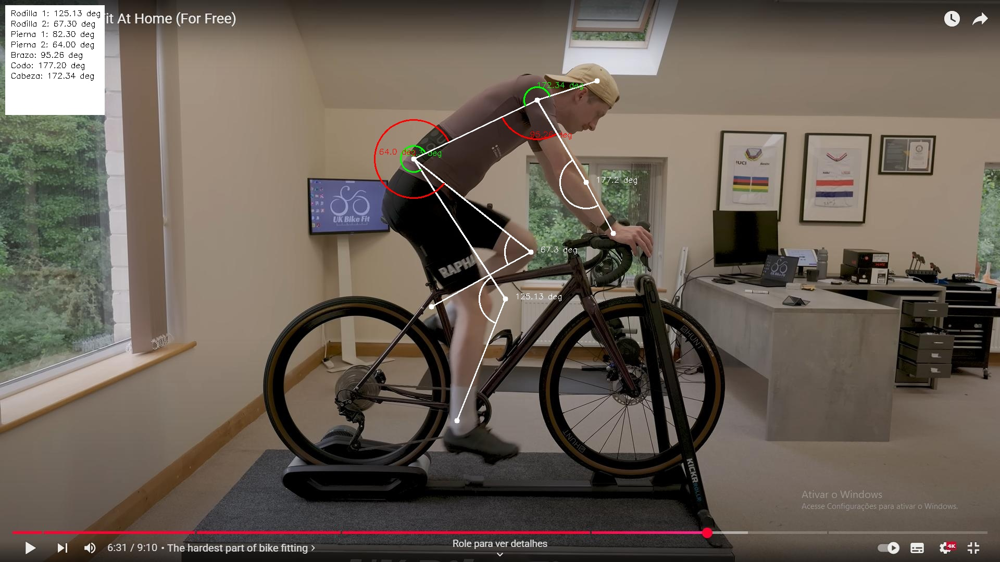

# 🚴 Biomecánica de Ciclistas basada en Visión Artificial

Este proyecto tiene como objetivo analizar la **biomecánica de un ciclista** en tiempo real utilizando **visión artificial**, una **webcam** y un modelo de **detección de poses YOLOv11**. Se calcula una serie de ángulos articulares clave a partir de los puntos corporales detectados, con fines de análisis postural, optimización del rendimiento y prevención de lesiones.


## 📌 Objetivo

Desarrollar una herramienta capaz de capturar y analizar los movimientos clave de un ciclista durante el pedaleo para:

- Evaluar la postura y simetría corporal.
- Medir ángulos articulares relevantes en miembros superiores e inferiores.
- Identificar posibles desalineaciones o sobrecargas.
- Proporcionar feedback visual y cuantitativo sobre la técnica de pedaleo.


## 📖 Tabla de Contenidos
- [🧰 Tecnologías utilizadas](#-tecnologías-utilizadas)
- [📦 Estructura de carpetas](#-estructura-de-carpetas)
- [⚙️ Requisitos](#-requisitos)
- [📥 Instalación](#-instalación)
- [▶️ Ejecución](#️-ejecución)
- [🧠 Explicación del código](#-explicación-del-código)
  - [main.py](#mainpy--análisis-biomecánico-a-partir-de-vídeo-o-imagen)
  - [train_model.py](#train_modelpy--entrenamiento-del-modelo-yolov11-pose)
- [📊 Resultados actuales](#-resultados-actuales)
- [🚧 Desarrollos futuros](#-desarrollos-futuros)
- [📩 Contacto](#-contacto)

## 🧰 Tecnologías utilizadas

- **Python 3.X**: Lenguaje principal.
- **OpenCV**: Procesamiento y visualización de vídeo.
- **Ultralytics YOLOv11**: Modelo de detección de poses.
- **NumPy**: Cálculos numéricos y vectores.
- **math**: Cálculo de ángulos en coordenadas polares.
- **Ultralytics SDK**: Para entrenamiento y pruebas.

## 📦 Estructura de Carpetas
```
Biomecanica/
├── models/                # Carpeta que contiene el modelo YOLOv11
├── test/                  # Carpeta para pruebas
├── data/                  # Funciones utilitarias para el análisis
├── main.py                # Archivo principal que ejecuta el análisis
├── train.py               # Script para entrenar el modelo YOLOv11
├── requirements.txt       # Archivo de dependencias del proyecto
└── README.md              # Documentación del proyecto
```

## ⚙️ Requisitos
- Python 3.8 o superior
- OpenCV ≥ 4.5
- Ultralytics ≥ 8.x
- NumPy

Instala todo con:
```bash
pip install -r requirements.txt
```


## 📥​ Instalacion
1. Clona el repositorio:
   ```bash
   git clone https://github.com/Castro-3034-tbr/Biomecanica.git
   cd Biomecanica
   ```
2. Coloca el modelo entrenado YOLOv11 en models/best_Pose.pt.

   📌 Puedes entrenar el modelo tú mismo siguiendo los pasos de la siguiente sección o solicitar el modelo entrenado.


## ▶️​ Ejecución
Para analizar una imagen o un vídeo, ejecuta el siguiente comando:
```bash
python main.py
```

## 🧠 Explicación del Código
`main.py` – Análisis biomecánico a partir de vídeo o imagen

Este script es el núcleo funcional del sistema. Se encarga de:
1. **Cargar el modelo YOLOv11 Pose** desde `models/best_Pose.pt`.
2. **Leer el archivo de entrada** (imagen o vídeo) especificado en `input_file`.
3. **Detectar keypoints** usando el modelo YOLOv11.
4. **Calcular ángulos articulares** entre los puntos relevantes del cuerpo (rodillas, cadera, brazos, cabeza).
5. **Visualizar los ángulos** en la imagen/vídeo, dibujando líneas y arcos con OpenCV.
6. **Guardar los resultados** en un nuevo archivo de salida (`output_pose.jpg` o `output_pose_video.avi`).

Componentes principales:
- `CalculeAngles()`: calcula ángulos entre tres puntos usando trigonometría.
- `Draw()`: dibuja los puntos, líneas y arcos que representan los ángulos en pantalla.
- `AnalizarFrame()`: gestiona el análisis completo de un frame (detección + dibujo).
- `DrawAngles()`: renderiza los ángulos calculados en una zona visible del frame.

Soporte para modo imagen y modo vídeo, con generación de salida para ambos.

`train_model.py` – Entrenamiento del modelo YOLOv11 Pose
Este script permite entrenar un modelo personalizado de detección de poses con YOLOv11.

**Flujo del entrenamiento:**
1. **Carga del modelo base** (`yolo11n-pose.pt`) desde la carpeta `models/`.
2. **Lectura del archivo de configuración** data.yaml, que contiene:
   - Rutas a imágenes de entrenamiento y validación.
   - Clases y formato del dataset (en este caso, keypoints).

3. **Ejecución del proceso de entrenamiento** con los siguientes parámetros:
   - epochs: número total de épocas (por defecto 100).
   - imgsz: resolución de entrada (640).
   - batch: tamaño del batch.
   - device: GPU utilizada.
   - save_period: frecuencia con la que se guarda un checkpoint del modelo.

4. **Generación de los pesos entrenados** dentro de `./runs/train/yolo11n-pose/.`

Este archivo utiliza la API de Ultralytics, por lo que se requiere tener instalada la versión oficial del paquete ultralytics.

## 📊 Resultados Actuales
El sistema actual permite analizar biomecánicamente el pedaleo de un ciclista utilizando visión artificial con un modelo de pose basado en YOLOv11. Como se encuentra en una fase de prototipado los resultados no son de alta calidad. A continuación se detallan las funcionalidades implementadas:

✅ Entrenamiento basico del modelo YOLOv11 Pose con un dataset de keypoints.

✅ Detección de keypoints anatómicos en ciclistas (hombros, cadera, rodillas, tobillos, etc.) a partir de imágenes o vídeos previamente grabados.

✅ Visualización sobrepuesta de los puntos clave, conexiones esqueléticas y elementos geométricos auxiliares como líneas o elipses.

✅ Cálculo automático de ángulos articulares (por ejemplo, ángulo rodilla-cadera-tobillo) con visualización directa sobre la imagen.

✅ Representación gráfica del ángulo en pantalla y exportación en formato visual del frame con anotaciones biomecánicas.


En resumen, se ha establecido un sistema base sólido y funcional, sobre el cual se construirá un conjunto de herramientas de análisis avanzado en las siguientes etapas del proyecto.



## 🚧 Desarrollos Futuros
El proyecto está diseñado con una arquitectura modular para facilitar su ampliación. Algunas mejoras planificadas son:

- **Soporte para cámara en tiempo real**: Reemplazar el uso de archivos de imagen o vídeo por captura directa desde una o más webcams, permitiendo análisis en tiempo real con visualización en vivo.

- **Sistema multicámara**: Integrar múltiples ángulos de visión para reconstrucción 3D de la postura mediante triangulación de keypoints o fusión de modelos de pose multivista.

- **Sistema de calibración automática**: Añadir herramientas para calibrar el espacio de grabación (distancia, ángulos, orientación de cámaras), fundamental para precisión en análisis 3D.

- **Seguimiento temporal**: Incorporar análisis dinámico de la evolución de los ángulos a lo largo del tiempo (curvas angulares, detección de fases del pedaleo, ciclos de movimiento).

- **Exportación de datos**: Generar informes PDF, exportar métricas en CSV o integrar con plataformas de análisis biomecánico.

- **Modo comparación**: Comparar automáticamente la ejecución del ciclista frente a un modelo biomecánico ideal, con métricas de desviación y feedback.

- **Interfaz gráfica (GUI)**: Crear una interfaz amigable para controlar la cámara, visualizar resultados y gestionar sesiones de análisis sin necesidad de editar el código.

## 📩​ Contacto
Si tienes alguna pregunta o sugerencia, no dudes en contactarme a través de mi correo electrónico: 

[Castro_3034_tbr](mailto:danielcastrogomezzz@gmail.com)