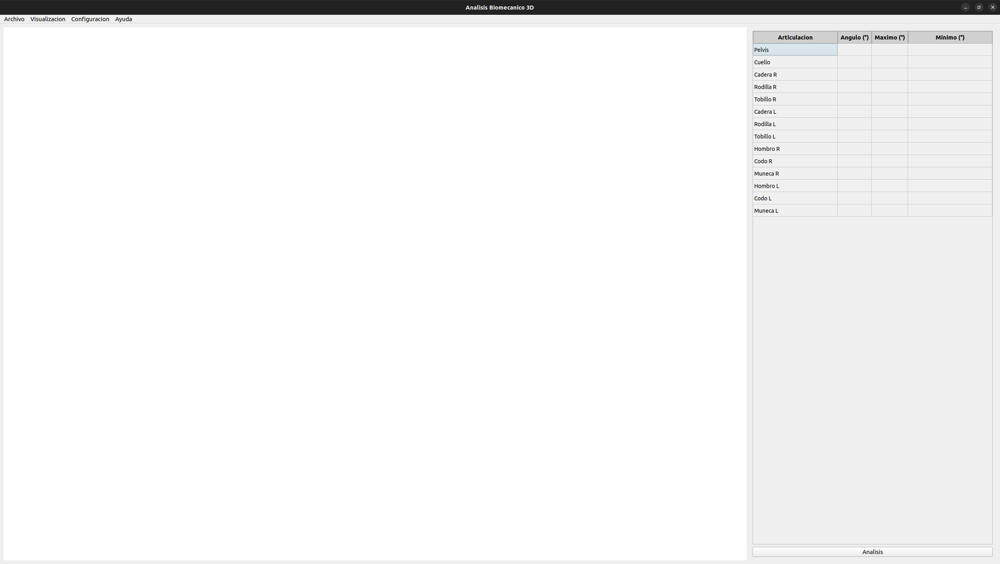
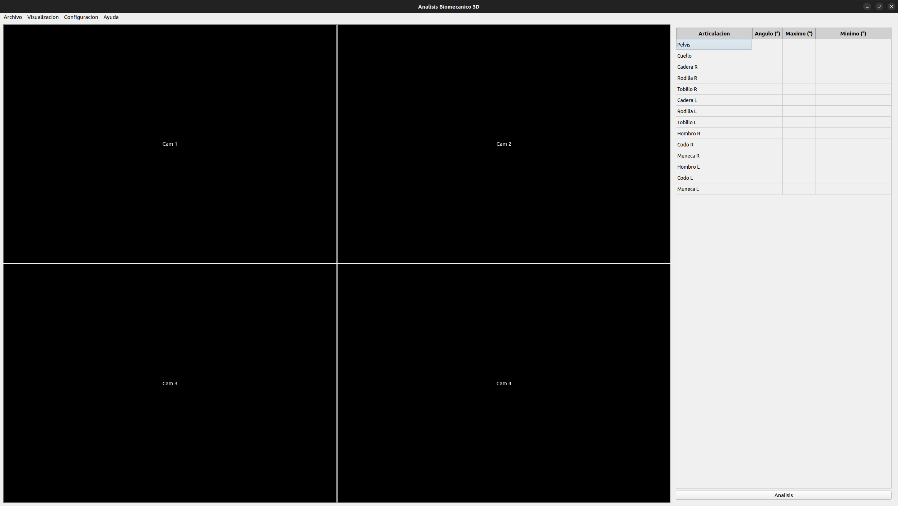
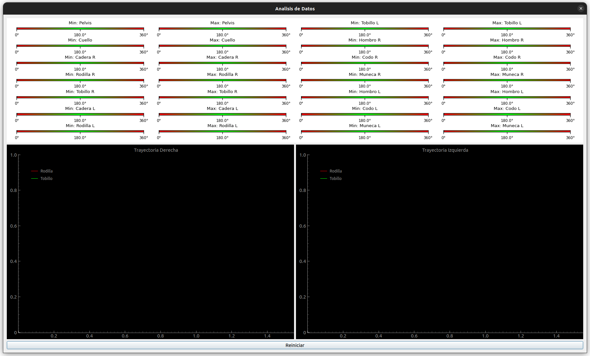
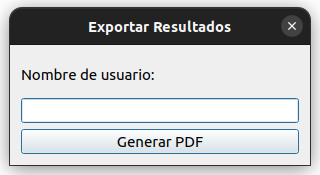

# BikeFitting 

Esta rama forma parte de un sistema de análisis biomecánico, y se encarga de proporcionar una interfaz gráfica de usuario (GUI) para visualizar resultados y exportarlos en formato PDF.

## 🎯 Objetivos

- Mostrar los resultados del análisis de forma visual e interactiva.

- Permitir al usuario exportar gráficos y datos clave en un documento PDF estructurado.

- Integrar las funciones de exportación sin depender de herramientas externas.

## 📦 Estructura de Carpetas
```
Biomecanica/
├── pdf/                    # Carpeta donde se almacenan los documentos PDF generados
├── .images/                # Carpeta donde se almacenan las imágenes generadas
├── .images_readme/         # Carpeta donde se almacenan las imágenes para el README
│   ├── ImagenCofCam.jpg
│   └── logo.png
├── GUI.py                  # Interfaz gráfica de usuario
├── ExportPDF.py            # Funciones para exportar a PDF
└── README.md               # Documentación del proyecto
```

## ⚙️ Requisitos
- NumPy
- PyQt5
- PyQtGraph
- Matplotlib
- ReportLab
- Pillow


## 1. Ventana Principal

La ventana principal actúa como el núcleo de la aplicación, proporcionando un acceso centralizado a todas las funciones del sistema de análisis biomecánico.
Desde aquí, el usuario puede navegar a las diferentes secciones, configurar el entorno de análisis, iniciar sesiones de captura y generar informes PDF.


### **1. Diseño de interfaz**

- Basada en PyQt5 con una disposición QVBoxLayout y QGridLayout para estructurar los componentes.

- Barra de herramientas y menús superiores para acceso rápido a funciones críticas. Divididos en cuatro menús diferentes:
  1. **Archivo**: Opciones para guardar y exportar datos mediante PDF y botón para salir.
  2. **Visualización**: Cambia entre los diferentes modos de visualización de datos entre Vista 2D y 3D. Para el cambio de vista es necesario configurar dos cámaras, para ambos laterales.
  3. **Configuración**: Ajustes de cámaras. Cuenta con la lista de camaras disponibles y la ejecucion del menu de configuracion de camaras.
  4. **Ayuda**: Acceso al repositorio de GitHub del proyecto y contacto.

- La **vista principal** se muestra en la izquierda las vistas configurables y en la derecha se muestra una tabla los angulos. Se muestra el angulo local, el valor maximo del angulo y el valor minimo del angulo.

### Vistas
- **Vista 2D**: Representación sobre las imagen capturada por la imagen, la informacion de los angulos



- **Vista 3D**: Representación tridimensional de la posición actual. (Se encuentra en desarrollo debido a errores de visualización)


## 2. Página de Análisis

La página de análisis es el entorno principal para visualizar y procesar los datos biomecánicos.

- **Visualización gráfica en tiempo real** mediante *PyQtGraph*.
- **Secciones divididas**:  
  - Gráficas comparativa de los angulos de cada articulacion respecto el rango de angulos optimo.
  - Trayectoria de los puntos clave de la rodilla y el tobillo.
- Controles para **reiniciar** los datos actuales.





## 3. Página de Exportación (Generación de PDF)

En esta sección el usuario puede **generar un informe en formato PDF** con los resultados del análisis.

- Botón principal para **exportar resultados**.
- Generación de documento PDF con:
  - Tabla de angulos maximos y minimos
  - Gráficas comparativa de los angulos de cada articulacion respecto el rango de angulos optimo.
  - Grafica de las trayectoria de los puntos clave del tobillo y de la rodilla


- Flujo optimizado para que el usuario no necesite guardar las gráficas manualmente; estas se extraen directamente.



## 4. Página de Configuración de cámaras

Permite ajustar la posicion de las camaras respecto al sujeto:


## 📩 Contacto

Para dudas, propuestas de colaboración o comentarios técnicos:

📧 [danielcastrogomezzz@gmail.com](mailto:danielcastrogomezzz@gmail.com)
GitHub: [Castro-3034-tbr](https://github.com/Castro-3034-tbr)
